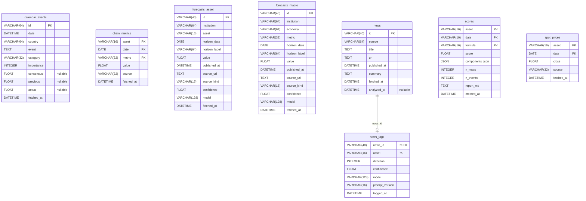

# Database schema

Generated from `src/manc/store/schema.py` by [paracelsus](https://github.com/tedivm/paracelsus);
a pre-commit hook rejects a commit that changes the schema without regenerating this file:

```sh
uv run paracelsus inject docs/er-schema.md
```

What the columns mean is in `docs/blueprint.md` section 6. The `asset` columns hold symbols
from `config/assets.yaml`; the only foreign key is `news_tags.news_id -> news.id`.

<!-- BEGIN_SQLALCHEMY_DOCS -->

<!-- END_SQLALCHEMY_DOCS -->
