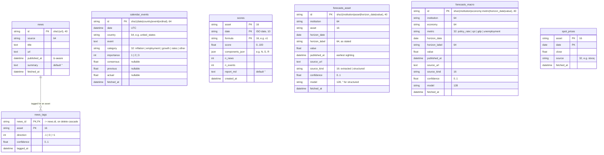

# manc — database schema

Entity-relationship view of `data/manc.db` as declared in `src/manc/store/schema.py`
(Alembic head `9bbb45ea6917`). The blueprint, section 6, explains the write rules; this page
only draws the tables. Keep it in step with `schema.py`: a new revision means an edit here.

## Reading the diagram

- **The only foreign key is `news_tags.news_id → news.id`** (cascade on delete). Every other
  table stands alone by design: a rescore or a forecast backfill never has to satisfy a
  constraint against another table.
- **`asset`, `country` / `economy` and `institution` are config keys, not tables.**
  `scores.asset`, `news_tags.asset`, `forecasts_asset.asset` and `spot_prices.asset` hold a
  symbol from `config/assets.yaml`; `calendar_events.country` and `forecasts_macro.economy`
  hold an economy key from the same file; `institution` comes from `config/forecasts.yaml`.
  They are joined in `queries.py`, not in SQL.
- **Composite keys encode the write rules.** `scores` is `(asset, date, formula)`, so a `v2`
  rescore sits next to the `v1` row; `spot_prices` is `(asset, date)` and a re-run overwrites
  the close; the two forecast tables key on the vintage hash and never overwrite, an upsert on
  an existing id only keeps the earlier sighting.
- **Timestamps** are timezone-aware `DateTime` stored as UTC; SQLite drops the zone, the
  store puts it back on read. `scores.date` is an ISO string; `horizon_date` and
  `spot_prices.date` are `Date` columns.
- `alembic_version` is omitted. Revisions so far: `d90ed1931246` initial, `9bbb45ea6917`
  forecasts and spot prices.
